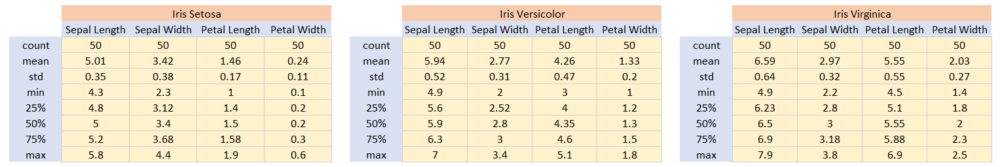

# Project2021

Project 2021 - Programming and Scripting GMIT

Author: Joana Ruas

Title: Fisher's Iris Dataset

-----------------------------------------------------------------------------------------------------------------------------
This is the background research prior to the analysis of the Fisher's Irish Dataset, and the analysis of results

-----------------------------------------------------------------------------------------------------------------------------

## THE Iris Fisher
The Iris Fisher dataset was developed by Ronal Fisher in 1936. The dataset consists in 50 samples of 4 parameters, for 3 flower species (Setosa, Versicolor and Virginica). The 4 parameters are Sepal Lenght, Speal Width, Petal Lenght and Petal Width. All parameters are in centimetres.
The combination of the four parameters, allowed Fisher to develope a linear discriminant model to distinguish the species from each other.
This dataset became a typical test case for many statistical classification techniques in machine learning. [A]

[B]

The data Ronal Risher used, were collected by the botanist Dr.Edgar Anderson and published in 1935. Anderson collected data from Iris Setosa and Iris Versicolor from Gaspe Peninsula, Canada. To make the data collection as accurate as possible, all samples were "from the same pasture, picked on the same day and measured at the same time by the same person with the same apparatus". For the Iris Virginica, the same rigor was applied to the collection. Anderson was a student in Washington University in St.Luis in 1929, when he took a fellowship to work in Britain with other scientists. One of these scientists was Ronal Fisher, who obtained Anderson's permission to use the data in the article (xxxx) in 1936: The Use of Multiple Measurements in Taxonomic Problems” in the journal Annals of Eugenics. [A,C]

## why STIL IMPORTANT TODAY?

## Goal of this research:
- Analysis data and identify the three species of Iris, based on that data analysis.

# Analysis of variables
The first step to understand the database was to evaluate the classic statistic parameters (number of samples, minumum and maximum values, average, standard deviation and percentils). This was the table obtained that summarizes the data for the 4 measures: Sepal Lenght, Sepal Width, Petal Length and Petal Width (data in centimeters):

Each parameter was measured for the three species mentioned above. To evaluate each parameter in each species, detailed tables were generated:

All the summary tables above can be found in the text file(VariablesSummary.txt) generated by the program (analysis.py) in the project folder. 
For an easier interpretation of data, histograms were developed. First, one histogram for each varaibles (disregarding the diferent species):

From the histograms above, it is possible to realize that the Sepal Length varies from 4 to 8 (aprox), the Sepal Width from 2 to 4.5 (aprox), the Petal Length from 1 to 7 (aprox) and the Petal Width from 0 t0 2.5 (aprox).
For this analysis, it was also developed the same histograms but showing the diferences between species within the same histogram. These histograms are below:

Analysing the histograms above, it is possible to see that species Stosa has the minimum values of the data for Petal Length, Sepal Length and Speal Width, and maximum values of the data for Petal Width. It is also possible to see that the histogram for Virginica (in blue) is always a little to the right of histogram Versicolor (in red), which means for the 4 parameters it has in general bigger values. Virginica has also the maximum values for Sepal Lenght, Petal Lenght and Petal Width. 

For a better perception of the veriables' relationship, a scatter plot was developed combining each of the varibles with the others, and always speficifing the 3 species in each plot. These plots can be found in the picture below:

From the scatter plotos, the conclusion more easy to spot is that Setosa parameters always have very different values comparing with the other two species. It is possible to visualize in the 4 images above that the yellow dots are always more isolated.
While for the Virginica and Versicolor, although the two "patches" or values are always very close to each other, it is possible to see a well defined boundary between the two species. The only situation where both species have overlapping values in a more considerable way is in the plot Sepal Length vs Sepal Width.

## Summary of steps taken in [Analysis.py] :
1. Download the fisher's iris data set to the project folder [1]
2. Converting the csv columns to lists of floats
3. Summary of each variable to a single text file. 

## REFERENCES:
[A]: https://en.wikipedia.org/wiki/Iris_flower_data_set
[B]: https://medium.com/@Nivitus./iris-flower-classification-machine-learning-d4e337140fa4
[C]: https://towardsdatascience.com/the-iris-dataset-a-little-bit-of-history-and-biology-fb4812f5a7b5
[1]: Dataset downloaded from https://tableconvert.com/?output=csv

