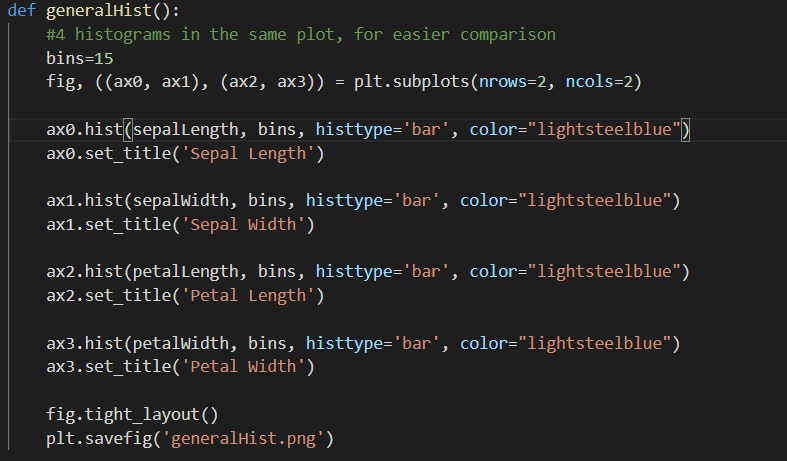

# Project2021

Project 2021 - Programming and Scripting GMIT

Author: Joana Ruas

Title: Fisher's Iris Dataset

-----------------------------------------------------------------------------------------------------------------------------
This is the background research prior to the analysis of the Fisher's Irish Dataset, and the analysis of results. 
The goal of this project is to use what we learnt in Programing and Scripting lectures, combined with our own research, to developed a code that allows the import and analysis of data. The ultimate goal regarding the analysis of that data is to be able to identify the three species of Iris.

-----------------------------------------------------------------------------------------------------------------------------
## Table of Contents

* [The Iris Fisher Dataset](#The-Iris-Fisher-Dataset)
* [Coding and Analysis of Results](#Coding-and-Analysis-of-Results)
    * [Modules used](#Modules-used)
    * [Reading from CSV](#Reading-from-CSV)
    * [Creating-Dataframe](#Creating-Dataframe)
    * [Variables-Analysis](#Variables-Analysis)
    * [Writing-into-Text-File](#Writing-into-text-file)
    * [VariablesSummary.txt](#VariablesSummary.txt)
    * [Histograms](#Histograms)
    * [Scatter](#Scatter)
* [References](#References)

## The Iris Fisher Dataset
The Iris Fisher dataset was developed by Ronal Fisher in 1936. The dataset consists in 50 samples of 4 parameters, for 3 flower species (Setosa, Versicolor and Virginica). The 4 parameters are Sepal Lenght, Speal Width, Petal Lenght and Petal Width. All parameters are in centimetres.
The combination of the four parameters, allowed Fisher to develope a linear discriminant model to distinguish the species from each other.
This dataset became a typical test case for many statistical classification techniques in machine learning. [3,4]

The data Ronal Risher used, were collected by the botanist Dr.Edgar Anderson and published in 1935. Anderson collected data from Iris Setosa and Iris Versicolor from Gaspe Peninsula, Canada. To make the data collection as accurate as possible, all samples were "from the same pasture, picked on the same day and measured at the same time by the same person with the same apparatus". For the Iris Virginica, the same rigor was applied to the collection. Anderson was a student in Washington University in St.Luis in 1929, when he took a fellowship to work in Britain with other scientists. One of these scientists was Ronal Fisher, who obtained Anderson's permission to use the data in the article (xxxx) in 1936: The Use of Multiple Measurements in Taxonomic Problems” in the journal Annals of Eugenics. [3,5]

WHY STIL IMPORTANT TODAY?

## Coding and Analysis of Results
### Modules used:
To reach what was required in this project, it was necessary to import a few modules into Python:

**_CSV_** was the module imported to allow reading the csv file containing the Iris Fisher Dataset. The csv module implements classes to read and write tabular data in CSV format. [6]

**_Pandas_** was the module imported to create a database with the variables exported from the csv file. As it will be explained below, it was the easier way to get the analysis of those variables, as Pandas has spefic functions for data analysis. Pandas is a module widely used for data science / data analytics. [7]

**_Matplotlib_** was the module imported for plotting the histograms and scatters required in the project. Matplotlib is a comprehensive library for creating static, animated, and interactive visualizations in Python.[8]

### Reading from CSV:
The dataset was downloaded in CSV format and saved in the project folder [9]. To read and access the data, this was the code used:

An empty dict called data was defined, and then for each row of the CSV file, the header of the column and the respective value were appended do the dict[10].
The data exported from the CSV file was string type. For this analysis it was necessary to convert the data into floats[11]. To convert all data into floats, keeping the info organized as per the CSV columns, it was used the code below, where the conversion was for done for each column in separate:

### Creating Dataframe
From the lists obtained on the step described above, it was first created a Dict with the info from all columns organized[12]. With that Dict, it was then created a dataframe using the module pandas[13], as it is exemplified below:

### Variables Analysis
After the dataframe was created, it was used the built-in function describe() from pandas to get the analysis of each variable automatically.
As the goal was to analyse generally and then locally (i.e, for each species), the describe function was used for each of the species besides the general analysis. The precision of data was set to 2 decimal places [14].

### Writing into txt File
First, an empty textfile was created - VariablesSummary.txt.
The outputs of that analysis was written into a text file that is also included in the project folder. To write the outputs of the analysis into that file, it was created the code below:

To values had to be converted to string in order to make the written operation possible.

### VariablesSummary.txt

The text file generated by the python program looks like image below:

The full text file can be found in the project folder. All data in centimeters,
In terms of coding, there were a lot of steps before this one, but in terms of data analysis, this was the step where it was first possible to analise the data, throughout the classic statistic parameters (number of samples, mininum and maximum values, average, standard deviation and percentils. The table obtained summatizes the data for the 4 measures: Speal Length, Sepal Width, Petal Length and Petal Width.

### Histograms
It is usually easier to analyse data in graphical way. Histograms represent the frequency of data within specified buckets, where:
 - x-axis has the buckets of outcomes
 - y-axis has the number count or percentage of occurrences in the data for each column.
With an histogram so, it is possible to analise the distribution of the values[15].

First, it was developed an histogram for each variable (Sepal Lenght, Sepal With, Petal Lenght, Petal Width), disregarding the different species. This was obtained using the code below:

The 4 plots were generated in the same image, for easier comparison. For that, the code had to be modified from a normal plot, defining the number of rows and columns in the generated plot, in this case 2 rows and 2 columns [16]. The plot generated is below and also saved in the project folder as generalHist.png:

From the histograms above, it is possible to realize that the Sepal Length varies from 4 to 8 (aprox), the Sepal Width from 2 to 4.5 (aprox), the Petal Length from 1 to 7 (aprox) and the Petal Width from 0 t0 2.5 (aprox). While Sepal Length and Sepal Width have a more "regular" histogram, Petal Lenght and Petal Width have almost like two patches of values. To understand what may be causing this, the histograms for the same variables but showing the different kinds of species were developed:

As it is possible to see, in Petal Lenght and Petal Width, the group of data on the left side of the histogram (meaning minor values), corresponds to only single species - Setosa, while the rest of the histogram has values from the other two species - Virginica and Versicolor. It is also possible to conclude that for the 4 variables, each species has their group of data together (in similar values). It is possible to see that species Stosa has the minimum values of the data for Petal Length, Sepal Length and Speal Width, and maximum values of the data for Petal Width. It is also possible to see that the histogram for Virginica (in blue) is always a little to the right of histogram Versicolor (in red), which means for the 4 parameters it has in general bigger values. Virginica has also the maximum values for Sepal Lenght, Petal Lenght and Petal Width. 

### Scatter
A scatter plot is a graph with two variables, where the pattern created by the points, shows the correlation between those variables.[22]
For this project, scatter plots where developed to analise the correlation between all the variables, meaning that each variable was combined in a scatter with the 3 remaining variables. For each plot, the 3 species were identified, for a better perception of the results.

The code to get these plots was as the following image: 

The complete code can be found in the program analysis.py. The outputs are shown below:

#

### Varaibles Analysis

From the scatter plotos, the conclusion more easy to spot is that Setosa parameters always have very different values comparing with the other two species. It is possible to visualize in the 4 images above that the yellow dots are always more isolated.
While for the Virginica and Versicolor, although the two "patches" or values are always very close to each other, it is possible to see a well defined boundary between the two species. The only situation where both species have overlapping values in a more considerable way is in the plot Sepal Length vs Sepal Width.

## REFERENCES:
### Git Hub ReadMe file manipulation:
[1] https://bulldogjob.com/news/449-how-to-write-a-good-readme-for-your-github-project
[2] https://docs.github.com/pt/github/writing-on-github/basic-writing-and-formatting-syntax

### Iris Fisher Dataset:
[3] https://en.wikipedia.org/wiki/Iris_flower_data_set
[4] https://medium.com/@Nivitus./iris-flower-classification-machine-learning-d4e337140fa4
[5] https://towardsdatascience.com/the-iris-dataset-a-little-bit-of-history-and-biology-fb4812f5a7b5

### Python Modules:
[6] https://docs.python.org/3/library/csv.html
[7] https://www.activestate.com/resources/quick-reads/what-is-pandas-in-python-everything-you-need-to-know/
[8] https://matplotlib.org/

### Dataset Download:
[9] Dataset downloaded from https://tableconvert.com/?output=csv

### Reading from CSV:
[10] https://stackoverflow.com/questions/19486369/extract-csv-file-specific-columns-to-list-in-python

### Converting to Floats:
[11] https://stackoverflow.com/questions/1614236/in-python-how-do-i-convert-all-of-the-items-in-a-list-to-floats

### DataFrame to Textfile:
[12] https://www.tutorialspoint.com/python_pandas/python_pandas_descriptive_statistics.htm
[13] https://www.w3resource.com/pandas/dataframe/dataframe-describe.php
[14] https://pandas.pydata.org/pandas-docs/stable/user_guide/options.html

### Hitograms and Scatters
[15] https://www.investopedia.com/terms/h/histogram.asp
[16] https://matplotlib.org/stable/gallery/subplots_axes_and_figures/subplots_demo.html
[17] https://jakevdp.github.io/PythonDataScienceHandbook/04.05-histograms-and-binnings.html
[18] https://matplotlib.org/stable/gallery/color/named_colors.html
[19] https://stackoverflow.com/questions/6963035/pyplot-axes-labels-for-subplots
[20] https://stackoverflow.com/questions/14088687/how-to-change-plot-background-color
[21] https://stackoverflow.com/questions/52056261/how-to-set-label-for-each-subplot-in-a-plot-in-matplotlib
[22] https://www.mathsisfun.com/definitions/scatter-plot.html
[23] https://matplotlib.org/stable/gallery/color/named_colors.html
[24] https://stackoverflow.com/questions/6963035/pyplot-axes-labels-for-subplots
[25] https://stackoverflow.com/questions/14088687/how-to-change-plot-background-color
[26] https://stackoverflow.com/questions/52056261/how-to-set-label-for-each-subplot-in-a-plot-in-matplotlib
    
